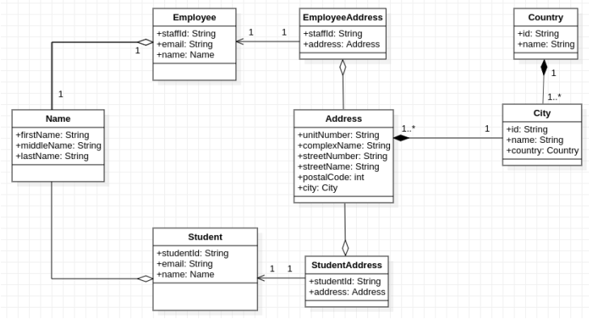

#School Management System

---

##Uml diagram for School management project

---

The group analyzed that this diagram has tightly coupled relationships, which reduced the flexibility of the code.
Some of the interfaces are highly dependent on each other, changing one object requires changes to another number of objects, it is more difficult to reuse and test some classes because they are dependent on other classes

Loosely coupling the interdependencies between system components would help reduce the risk that changes to one component would require changes to any other component and increase the flexibility of the system.